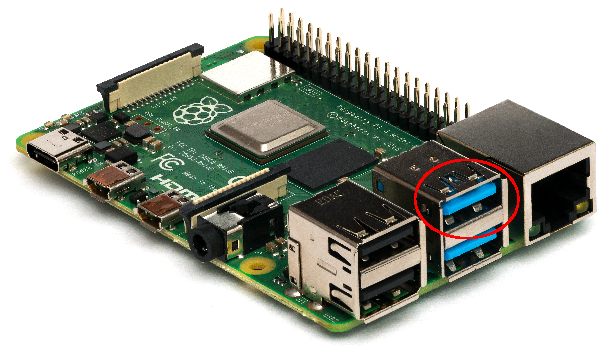

# Tips
Here are a few useful tips for working with NeonOS

## SSH
You can connect a remote terminal to your NeonOS device using SSH and the default
username/password of `neon`/`neon`. For most terminals, the command will look like:
```
ssh neon@<Neon Device IP Address>
```

## On-device Terminal
There are two methods for accessing a terminal on a Mark2 device.

### GUI Terminal
A terminal UI overlaid on the GUI can be accessed on a NeonOS device by connecting a keyboard and
pressing `ctrl`+`shift`+`f1`. The terminal will be shown on-screen until dismissed
but note that changes in the GUI may take focus away from the terminal until you tap/click it again.

### TTY Terminal
[`getty`](https://en.wikipedia.org/wiki/Getty_(Unix)) can be used to access multiple
terminals by connecting a keyboard and pressing `alt`+`F2`-`F6`. `alt`+`F1` will
return to the GUI, leaving any other sessions running in the background.

## Taking a screenshot
You can ask Neon to "take a screenshot" to create a screenshot saved on-device.
> If you have a terminal session open, you can also use `mana say-to "take a screenshot"`.

The path of the created file will be displayed on-screen as a notification. This
path is generally in `~/Pictures`. To retrieve a screenshot, you can use `scp` 
or shut down your mark 2 and plug the USB drive into another computer that can 
read an EXT4 file system(Linux or MacOS). The file is generally located in
`<root>/overlay/upperdir/home/neon/Pictures`.
> You will need root permissions to open this path in Linux.

## Getting device IP address
You can ask Neon "what is my IP address" to get the device IP address. You can
also access this via the `Settings Menu`, under `About`.

## Installing On Raspberry Pi
The OS drive should be installed to the port marked in the image below. Other
ports may work, but installing to the proper port ensures that the boot drive
is loaded first and helps avoid issues with other USB devices at boot time.

